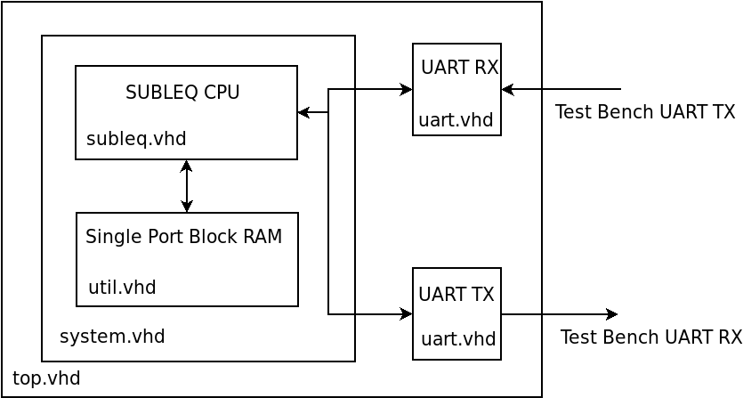
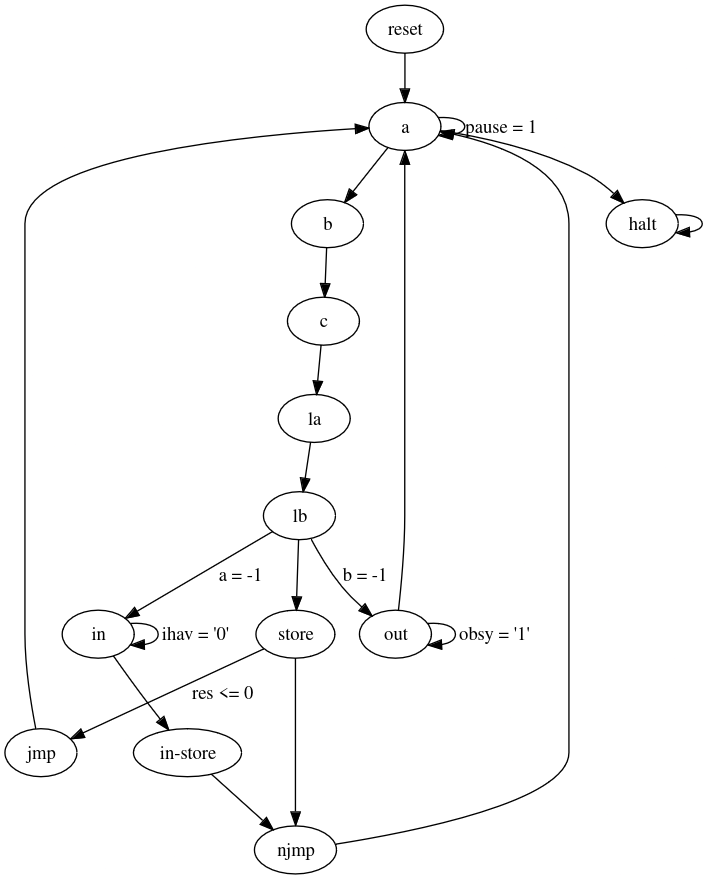

# 16-bit SUBLEQ CPU written in VHDL with an eForth interpreter

* Author: Richard James Howe
* License: [The Unlicense](LICENSE) / Public Domain
* Email: <mailto:howe.r.j.89@gmail.com>
* Repo: <https://github.com/howerj/subleq-vhdl>

**This project is a work in progress. The VHDL simulation works, along
with the eForth interpreter that runs on it, but the project has not
been tested on an actual FPGA (it does synthesize).**.

This project contains a 16-bit SUBLEQ CPU written in VHDL that should
run on an FPGA (it is unlikely to be tested in actual hardware anytime
soon, instead being simulation only). It has be synthesized for a
Spartan-6 and there is nothing that stands out as indicating that the
design would not work, it has just not actually been run on one (yet).

If you feel like supporting the project you can buy a book from
Amazon, available [here](https://www.amazon.com/SUBLEQ-EFORTH-Forth-Metacompilation-Machine-ebook/dp/B0B5VZWXPL)
that describes how the eForth interpreter works and how to port a Forth to
a new platform.

A block diagram of the project for those with no imagination:

Note that this project, unlike many other SUBLEQ CPUs written for
FPGAs in *whatever hardware description language* implements the full machine
without any *weird differences*, includes Input/Output, and halting. It
even reads the "standard" format used to describe SUBLEQ programs which
consists of spaced delimited ASCII signed decimal values (currently 
only one value is allowed per line, many SUBLEQ programs are stored all
on one line with only spaces as separators).

Weird/"non-standard" things include:

- Not having a way to halt the CPU.
- Having different bit widths for various operands.
- Storing the negation of the input instead of just storing it.
- Only being 8 bit (with 256 bytes for program storage).

The pseudo code for a SUBLEQ machine is:

	while pc >= 0:
		a = mem[pc]
		b = mem[pc + 1]
		c = mem[pc + 2]
		pc = pc + 3
		if a = -1:
			mem[b] = input_byte()
		else if b = -1:
			output_byte(mem[a])
		else
			r = mem[b] - mem[a]
			if r <= 0:
				pc = c
			mem[b] = r
	
This system tries to be as faithful as possible to this.

A (smallish) C program equivalent to this for a 16-bit SUBLEQ
machine is (given 16-bit `short` integers that wrap on overflow and 
underflow):

	#include <stdint.h>
	#include <stdio.h>

	int main(int argc, char **argv) {
		short m[1<<13], pc = 0;
		for (long i = 1, d = 0; i < argc; i++) {
			FILE *f = fopen(argv[i], "r");
			if (!f)
				return 1;
			while (fscanf(f, "%ld,", &d) > 0)
				m[pc++] = d;
			if (fclose(f) < 0)
				return 2;
		}
		for (pc = 0; pc >= 0;) {
			short a = m[pc++], b = m[pc++], c = m[pc++];
			if (a == -1) {
				m[b] = getchar();
			} else if (b == -1) {
				if (putchar(m[a]) < 0)
					return 3;
				if (fflush(stdout) < 0)
					return 4;
			} else {
				short r = m[b] - m[a];
				if (r <= 0)
					pc = c;
				m[b] = r;
			}
		}
		return 0;
	}

There is a [simulator written in C](subleq.c) that can be used
to run the [eForth image](subleq.dec).

## Usage

Type:

	make run

To run the C simulator on the [subleq.dec][] image. (Requires make
and a C compiler, alternatively `cc subleq.c -o subleq && ./subleq subleq.dec`
will work.

Type `words` to see a list of defined Forth words.

	$ make run
	./subleq subleq.dec
	 ok
	words
	cold quit load evaluate set-input get-input list
	blank block buffer empty-buffers flush save-buffers
	update b/buf at-xy page bell ms [if] [else] [then]
	defined dump see compile-only immediate postpone \ .(
	( abort" $" ." exit rdrop r> >r marker does> >body user
	constant variable create next aft for else repeat while
	then again until if begin recurse ' :noname : ; [char]
	char word definitions +order -order (order) get-order
	interpret compile, literal compile find search-wordlist
	cfa nfa compare .s number? >number . u. u.r sign <# #s #
	#> hold parse -trailing query tib expect accept echo /
	mod /mod m/mod um/mod * um* d+ dnegate um+ abort throw
	catch space erase fill cmove type +string count c, ,
	allot align aligned source 2r> 2>r 2@ 2! source-id min
	max c! c@ lshift +! pick set-current get-current cr emit
	key key? ?exit execute cell- cells cell+ cell abs s>d
	negate within u<= u>= u> u< <= >= 0>= 0< > < 0<= 0<> 0>
	<> = 2dup 2drop -rot rot r@ ?dup tuck nip [ ] decimal hex
	rp! rp@ sp! sp@ here bl span >in state hld dpl base scr blk
	context #vocs pad this root-voc current <ok> ! @ 2/ and or
	xor invert over ) 1- 1+ 2* 0= rshift swap drop dup bye -
	+ eforth words only forth system forth-wordlist set-order

	bye

Hitting `ctrl-d` will not quit the interpreter, you must type `bye` (or
kill with `ctrl-c` if `ctrl-d` has been used to close the input stream
already).

Type:

	make

Or:

	make simulation

To run the VHDL simulation under GHDL.

	make viewer

Can be used to automatically run GTKWave on the simulation results.

To make something you can flash to a Spartan-6 FPGA for a Nexys-3 board:

	make synthesis implementation bitfile upload

This requires Xilinx ISE 14.7 which is horrendously out of date by now,
along with the fact that the Nexys-3 board is obsolete (I need a new
FPGA board).

Have fun!

## State machine diagram

The following shows a state-machine diagram for the SUBLEQ CPU, it is not
optimal, but it is *simple*. There are some obvious optimizations that could
be done (such as going straight from `a` to the `in` state if `a` is `-1`,
which would also perhaps allow us to reuse the `-1` check circuitry), these
I/O optimizations would not help *much* as most of the time is spent doing
computation. The `store` state could be skipped if the contents of the result
register is equal to what is loaded into the `lb` register.

This is the source for the above image, which is [Graphviz][] code, this
can be pasted into [GraphvizOnline][].

	digraph subleq {
	  reset -> a;
	  a -> b;
	  a -> a [label = "pause = 1"];
	  a -> halt;
	  b -> c;
	  c -> la;
	  c -> lb [label = "a = -1"];
	  la -> lb;
	  la -> out [label = "b = -1"];
	  lb -> store;
	  lb -> in [label = "a = -1"];
	  halt -> halt;

	  store -> jmp [label="jmp\nres <= 0"];
	  store -> njmp;

	  jmp -> a;
	  njmp -> a;

	  in -> in [label="ihav = '0'"];
	  in -> store;

	  out -> a;
	  out -> out [label="obsy = '1'"];
	}

## To Do and Wish List

* [x] Do core implementation
  * [x] Debug application
* [x] Make small SUBLEQ test programs
* [x] Get implementation working in simulator with test programs
  * [x] `hi.dec`
  * [x] `hello.dec`
  * [x] `subleq.dec` (eForth interpreter)
    * [x] Test output
    * [x] Test input (requires better test bench)
  * [x] `echo.dec` (optional)
  * [x] `self.dec` with `hi.dec` (optional)
* Improve test bench
  * [x] Add more run time configuration options
  * [x] Add a UART that can print to STDOUT and read from STDIN (or a FILE)
* [x] Make cut-down and special SUBLEQ eForth image for the smaller (16KiB) BRAM
* [ ] Make one big VHDL file containing an initial Forth image and place it in `subleq.vhd`?
  * [x] Add a component that combines the Block RAM and SUBLEQ into one along
    with a test bench for it
  * [x] Merge new module into main system.
* [ ] Get implementation working in hardware (need an FPGA board for this)
* [ ] Improve the SUBLEQ Core and system
  * [ ] Find way of interacting with other hardware
  * [x] Currently there is no way for the SUBLEQ core to signal that it
        is waiting on I/O. A `paused` line when either the `pause` line
        is asserted, or when we are waiting for input or output would
        suffice (we can determine why from other signals).
  * [ ] Optimize SUBLEQ design for slice area (and speed if possible)
  * [x] Instead of loading hexadecimal files, load the original signed decimal 
        files, this would simplify the build process and allow `hex.c` to be
        removed.
    * [ ] Allow multiple numbers per line.
  * [ ] Use the UART from Nandland instead of my own, it appears to be smaller
        and simpler (which would aid in simulation).
  * [ ] Hook up `blocked` and `halted` to an LED?
* [x] Using Graphviz online, make a state-machine diagram
* [ ] Make a block diagram of the system

## Other SUBLEQ projects

* <https://github.com/howerj/subleq>
* <https://github.com/howerj/subleq-forth>
* <https://github.com/howerj/subleq-js>
* <https://github.com/howerj/subleq-perl>
* <https://github.com/howerj/subleq-python>
* <https://github.com/pbrochard/subleq-eForthOS>

## References

* <https://en.wikipedia.org/wiki/Forth_(programming_language)>
* <https://en.wikipedia.org/wiki/One-instruction_set_computer>
* <https://github.com/howerj/bit-serial>
* <https://github.com/howerj/embed>
* <https://github.com/howerj/forth-cpu>
* <https://rosettacode.org/wiki/Subleq>
* <https://stackoverflow.com/questions/2982729>
* <https://stackoverflow.com/questions/34120161>
* <https://web.ece.ucsb.edu/~parhami/pubs_folder/parh88-ijeee-ultimate-risc.pdf>

[GraphvizOnline]: https://dreampuf.github.io/GraphvizOnline
[Graphviz]: https://graphviz.org/

