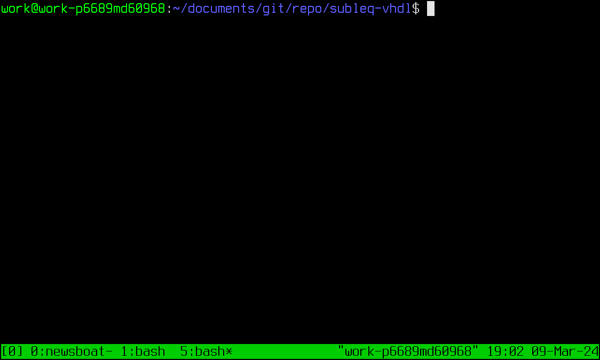
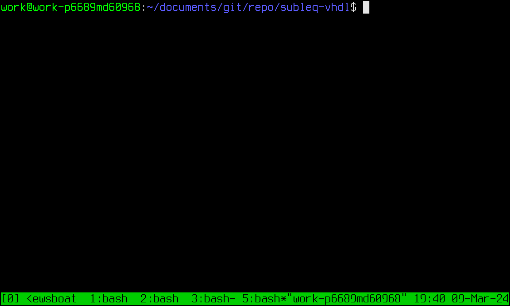
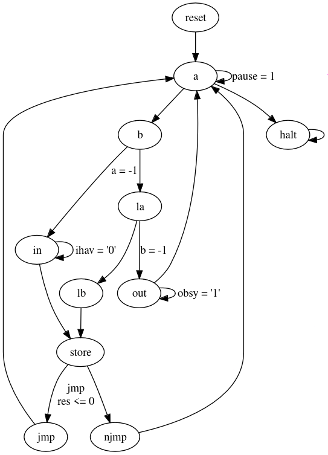

# 16-bit SUBLEQ CPU written in VHDL with an eForth interpreter

* Author: Richard James Howe
* License: [The Unlicense](LICENSE) / Public Domain
* Email: <mailto:howe.r.j.89@gmail.com>
* Repo: <https://github.com/howerj/subleq-vhdl>

**This project is a work in progress. The VHDL simulation works, along
with the eForth interpreter that runs on it, but the project has not
been tested on an actual FPGA (it does synthesize).**.

This project contains a 16-bit SUBLEQ CPU written in VHDL that should
run on an FPGA (it is unlikely to be tested in actual hardware anytime
soon, instead being simulation only). It has be synthesized for a
Spartan-6 and there is nothing that stands out as indicating that the
design would not work, it has just not actually been run on one (yet).

If you feel like supporting the project you can buy a book from
Amazon, available [here](https://www.amazon.com/SUBLEQ-EFORTH-Forth-Metacompilation-Machine-ebook/dp/B0B5VZWXPL)
that describes how the eForth interpreter works and how to port a Forth to
a new platform.

If you are trying the eForth interpreter out on actual hardware note that you
will have to leave a roughly 3 millisecond delay, at minimum, between 
sending characters. This is not usually a problem when typing but can be when
redirecting a file into the UART. This for multiple reasons, firstly the SUBLEQ
eForth is fairly slow, and secondly there is no buffering done on the UART.

A block diagram of the project for those with no imagination (you can
tell I am a programmer and not a graphic designer):

The C simulator running (not that characters are echoed back to the user, just
as they would be when using a UART, this can be disabled in the SUBLEQ image
or in your terminal):

The VHDL simulator is capable of *interactive* input and output, however
as this already long GIF shows the simulator takes a long time to do anything
and does not run long enough to simulate the input. Only the output is
simulated (the Forth interpreter prints " ok" followed by a newline).

And here you can see the FPGA build system running:

Note that this project, unlike many other SUBLEQ CPUs written for
FPGAs in *whatever hardware description language* implements the full machine
without any *weird differences*, includes Input/Output, and halting. It
even reads the "standard" format used to describe SUBLEQ programs which
consists of spaced delimited ASCII signed decimal values (currently                                                                    
only one value is allowed per line, many SUBLEQ programs are stored all                                                                
on one line with only spaces as separators).

Weird/"non-standard" things include:

- Not having a way to halt the CPU.
- Having different bit widths for various operands.
- Storing the negation of the input instead of just storing it.
- Only being 8 bit (with 256 bytes for program storage).

The pseudo code for a SUBLEQ machine is:

	while pc >= 0:
		a = mem[pc]
		b = mem[pc + 1]
		c = mem[pc + 2]
		pc = pc + 3
		if a = -1:
			mem[b] = input_byte()
		else if b = -1:
			output_byte(mem[a])
		else
			r = mem[b] - mem[a]
			if r <= 0:
				pc = c
			mem[b] = r
	
This system tries to be as faithful as possible to this.

A (smallish) C program equivalent to this for a 16-bit SUBLEQ
machine is (given 16-bit `short` integers that wrap on overflow and 
underflow):

	#include <stdint.h>
	#include <stdio.h>

	int main(int argc, char **argv) {
		short m[1<<13], pc = 0;
		for (long i = 1, d = 0; i < argc; i++) {
			FILE *f = fopen(argv[i], "r");
			if (!f)
				return 1;
			while (fscanf(f, "%ld,", &d) > 0)
				m[pc++] = d;
			if (fclose(f) < 0)
				return 2;
		}
		for (pc = 0; pc >= 0;) {
			short a = m[pc++], b = m[pc++], c = m[pc++];
			if (a == -1) {
				m[b] = getchar();
			} else if (b == -1) {
				if (putchar(m[a]) < 0)
					return 3;
				if (fflush(stdout) < 0)
					return 4;
			} else {
				short r = m[b] - m[a];
				if (r <= 0)
					pc = c;
				m[b] = r;
			}
		}
		return 0;
	}

There is a [simulator written in C](subleq.c) that can be used
to run the [eForth image](subleq.dec).

## Usage

Type:

	make run

To run the C simulator on the [subleq.dec][] image. (Requires make
and a C compiler, alternatively `cc subleq.c -o subleq && ./subleq subleq.dec`
will work.

Type `words` to see a list of defined Forth words.

	$ make run
	./subleq subleq.dec
	 ok
	words
	cold quit load evaluate set-input get-input list
	blank block buffer empty-buffers flush save-buffers
	update b/buf at-xy page bell ms [if] [else] [then]
	defined dump see compile-only immediate postpone \ .(
	( abort" $" ." exit rdrop r> >r marker does> >body user
	constant variable create next aft for else repeat while
	then again until if begin recurse ' :noname : ; [char]
	char word definitions +order -order (order) get-order
	interpret compile, literal compile find search-wordlist
	cfa nfa compare .s number? >number . u. u.r sign <# #s #
	#> hold parse -trailing query tib expect accept echo /
	mod /mod m/mod um/mod * um* d+ dnegate um+ abort throw
	catch space erase fill cmove type +string count c, ,
	allot align aligned source 2r> 2>r 2@ 2! source-id min
	max c! c@ lshift +! pick set-current get-current cr emit
	key key? ?exit execute cell- cells cell+ cell abs s>d
	negate within u<= u>= u> u< <= >= 0>= 0< > < 0<= 0<> 0>
	<> = 2dup 2drop -rot rot r@ ?dup tuck nip [ ] decimal hex
	rp! rp@ sp! sp@ here bl span >in state hld dpl base scr blk
	context #vocs pad this root-voc current <ok> ! @ 2/ and or
	xor invert over ) 1- 1+ 2* 0= rshift swap drop dup bye -
	+ eforth words only forth system forth-wordlist set-order

	bye

Hitting `ctrl-d` will not quit the interpreter, you must type `bye` (or
kill with `ctrl-c` if `ctrl-d` has been used to close the input stream
already).

Type:

	make

Or:

	make simulation

To run the VHDL simulation under GHDL.

	make viewer

Can be used to automatically run GTKWave on the simulation results.

To make something you can flash to a Spartan-6 FPGA for a Nexys-3 board:

	make synthesis implementation bitfile upload

This requires Xilinx ISE 14.7 which is horrendously out of date by now,
along with the fact that the Nexys-3 board is obsolete (I need a new
FPGA board).

Have fun!

## State machine diagram

The following shows a state-machine diagram for the SUBLEQ CPU, it is not
optimal, but it is *simple*. There are some obvious optimizations that could
be done (such as going straight from `a` to the `in` state if `a` is `-1`,
which would also perhaps allow us to reuse the `-1` check circuitry), these
I/O optimizations would not help *much* as most of the time is spent doing
computation. The `store` state could be skipped if the contents of the result
register is equal to what is loaded into the `lb` register.

This is the source for the above image, which is [Graphviz][] code, this
can be pasted into [GraphvizOnline][].

	digraph subleq {
	  reset -> a;
	  a -> b;
	  a -> a [label = "pause = 1"];
	  a -> halt;
	  b -> la;
	  b -> in [label = "a = -1"];
	  la -> lb;
	  la -> out [label = "b = -1"];
	  lb -> store;

	  store -> jmp [label="jmp\nres <= 0"];
	  store -> njmp;

	  jmp -> a;
	  njmp -> a;

	  in -> in [label="ihav = '0'"];
	  in -> store;

	  out -> a;
	  out -> out [label="obsy = '1'"];

	  halt -> halt;
	}

## Synthesis report

This is taken from a synthesis report (built using Xilinx ISE version 14.7) and
edited to remove redundant information so it fits on the screen, this was taken
from commit `28b35357db93a7e50f15f65377a3206afa66e265`.

	+---------------------------------------------------------------+
	| Module     | Slices | Slice Reg | LUTs    | BRAM/FIFO | BUFG  |
	+---------------------------------------------------------------+
	| top/       | 3/64   | 9/113     | 1/190   | 0/8       | 1/1   |
	| +system    | 1/37   | 0/55      | 0/124   | 0/8       | 0/0   |
	| ++bram     | 0/0    | 0/0       | 0/0     | 8/8       | 0/0   |
	| ++cpu      | 36/36  | 55/55     | 124/124 | 0/0       | 0/0   |
	| +uart_rx_0 | 12/12  | 24/24     | 39/39   | 0/0       | 0/0   |
	| +uart_tx_0 | 12/12  | 25/25     | 26/26   | 0/0       | 0/0   |
	+---------------------------------------------------------------+
	* No LUTRAM/DSP48A1/BUFIO/BUFR/DCM/PLL_ADV were used in this design.

As you can see the system is quite small. However there is still room for
improvement in terms of CPU size at least. A similar project,
<https://github.com/howerj/bit-serial>, implements a 16-bit bit-serial CPU,
which despite having more instructions is smaller than this already quite tiny
SUBLEQ CPU. A bit-serial SUBLEQ CPU, perhaps a project for a different time,
would be perhaps smaller still (whilst being much slower, glacial even).

## To Do and Wish List

* [x] Do core implementation
  * [x] Debug application
* [x] Make small SUBLEQ test programs
* [x] Get implementation working in simulator with test programs
  * [x] `hi.dec`
  * [x] `hello.dec`
  * [x] `subleq.dec` (eForth interpreter)
    * [x] Test output
    * [x] Test input (requires better test bench)
  * [x] `echo.dec` (optional)
  * [x] `self.dec` with `hi.dec` (optional)
* Improve test bench
  * [x] Add more run time configuration options
  * [x] Add a UART that can print to STDOUT and read from STDIN (or a FILE)
* [x] Using Graphviz online, make a state-machine diagram
* [x] Make a block diagram of the system
* [x] Use ttygif/ttyrec to record a terminal session showing the simulation, synthesis
      and running the C simulator.
* [x] Make cut-down and special SUBLEQ eForth image for the smaller (16KiB) BRAM
* [x] Improve the SUBLEQ Core and system
  * [x] Currently there is no way for the SUBLEQ core to signal that it
        is waiting on I/O. A `paused` line when either the `pause` line
        is asserted, or when we are waiting for input or output would
        suffice (we can determine why from other signals).
  * [x] Instead of loading hexadecimal files, load the original signed decimal 
        files, this would simplify the build process and allow `hex.c` to be
        removed.
    * [x] Allow multiple numbers per line (NOTE: Solution does not synthesize,
          so it has been commented out).
  * [x] Use the UART from [Nandland](https://nandland.com/) instead of my own, 
        it appears to be smaller and simpler (which would aid in simulation).
        It is also MIT licensed (or the version I have is).
  * [x] Optionally generate the UART test benches in the top level component
        as well as directly intefacing with `system.vhd` (again, optionally)
  * [x] Optimize number of states needed to execute a SUBLEQ instruction and 
        transitions in CPU (down from 8 to 6).
  * [x] Hook up `blocked` and `halted` to an LED? (The `blocked` line would
        need some kind of pulse lengthening to become visible) (will not do)
  * [x] Find way of interacting with other hardware (A mechanism has been
        proposed, but not implemented).
  * [x] Optimize SUBLEQ design for slice area (and speed if possible) (further
        improvements are always possible...)
* [ ] Make one big VHDL file containing an initial Forth image and place it in `subleq.vhd`?
  * [x] Add a component that combines the Block RAM and SUBLEQ into one along
    with a test bench for it
  * [x] Merge new module into main system.
  * [ ] Make a big file with everything in it.
* [ ] Get implementation working in hardware (need an FPGA board for this)

## Other SUBLEQ projects

* <https://github.com/howerj/subleq>
* <https://github.com/howerj/subleq-forth>
* <https://github.com/howerj/subleq-js>
* <https://github.com/howerj/subleq-perl>
* <https://github.com/howerj/subleq-python>
* <https://github.com/pbrochard/subleq-eForthOS>

## References

* <https://en.wikipedia.org/wiki/Forth_(programming_language)>
* <https://en.wikipedia.org/wiki/One-instruction_set_computer>
* <https://github.com/howerj/bit-serial>
* <https://github.com/howerj/embed>
* <https://github.com/howerj/forth-cpu>
* <https://rosettacode.org/wiki/Subleq>
* <https://stackoverflow.com/questions/2982729>
* <https://stackoverflow.com/questions/34120161>
* <https://web.ece.ucsb.edu/~parhami/pubs_folder/parh88-ijeee-ultimate-risc.pdf>

[GraphvizOnline]: https://dreampuf.github.io/GraphvizOnline
[Graphviz]: https://graphviz.org/

